# Uber like Api
Uber like Mini  Api To GetNearByCabs, View all your bookings And Do a Booking.<space><space>

First of All Create a database in postgres and put its credentials in .env file 

My .env file looks like this<space><space>
  <space><space>

API_SECRET= #Used when creating a JWT. It can be anything<space><space>
  
DB_HOST=yourdbip<space><space>
  
DB_DRIVER=postgres<space><space>
  
DB_USER=yourdbusername<space><space>
  
DB_PASSWORD=yourpassword<space><space>
  
DB_NAME=yourdbname<space><space>
  
DB_PORT=5432 #Default postgres port<space><space>
  
<space><space>
The .env file should be in top most directory of repository.<space><space>

To run clone the project and type  `go run main.go` in terminal.<space><space>

First of All we need to login :<space><space>

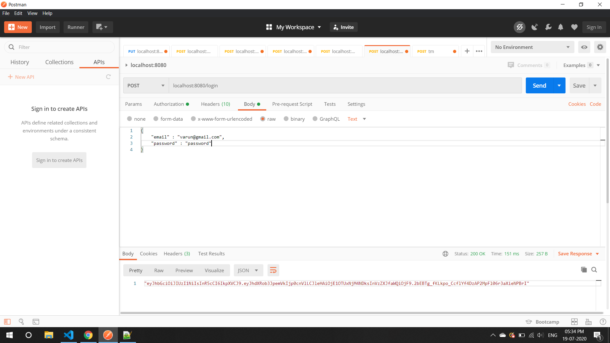

Put the JWT Token to the Authorization header and you are logged in.

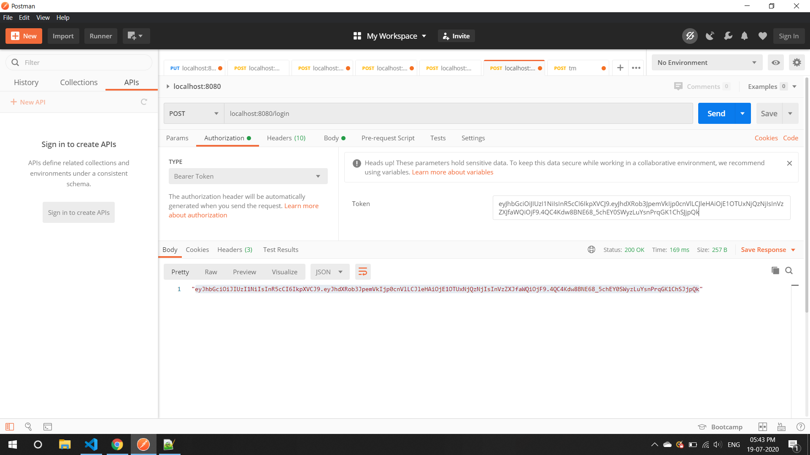

Now comes fun part you can view all the users 

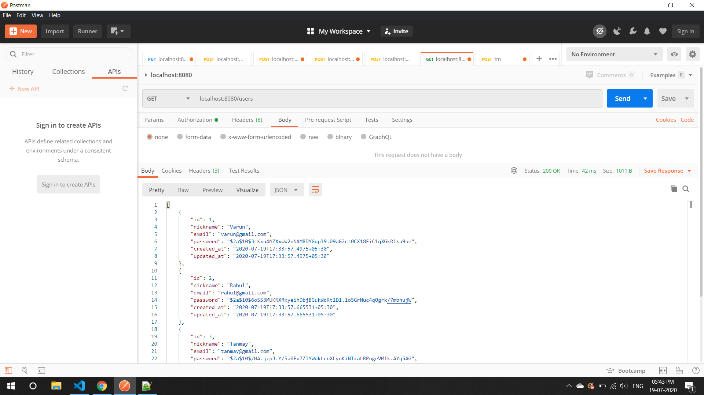

Create A New User

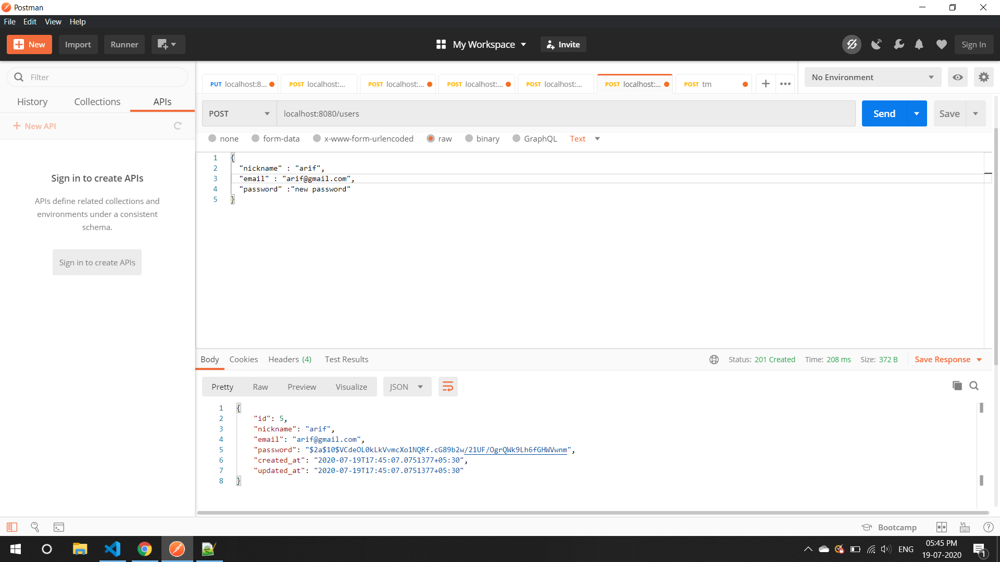

Update A User

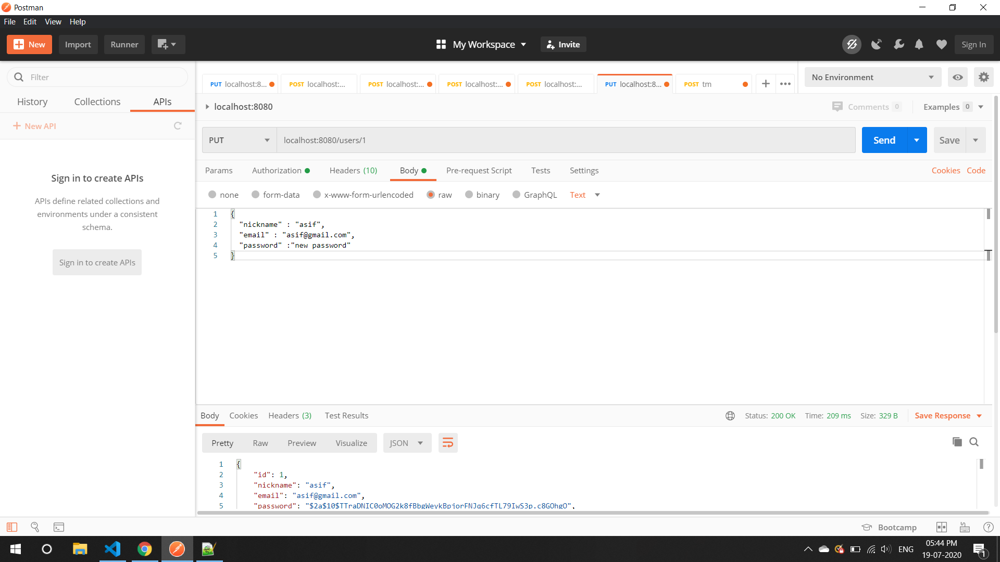

Delete A User

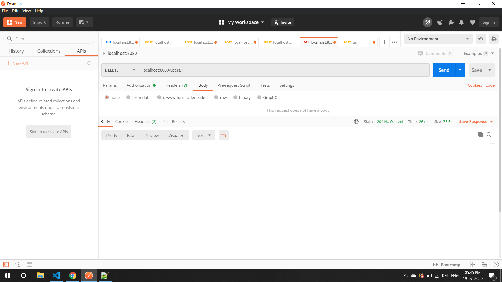

Get Nearby Cabs For <space><space>
This you need to give you need to give your current location and NearByRange in kilometers.
  
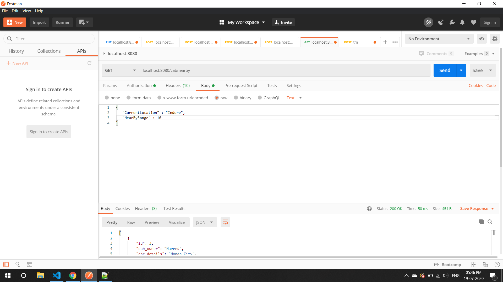
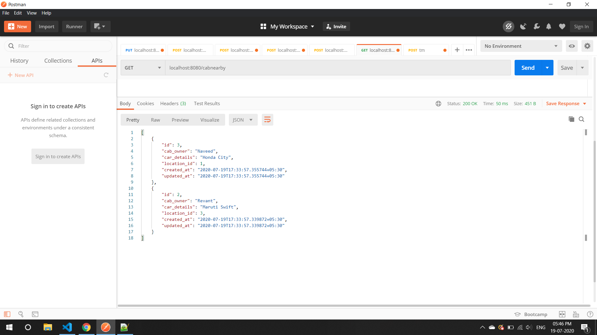
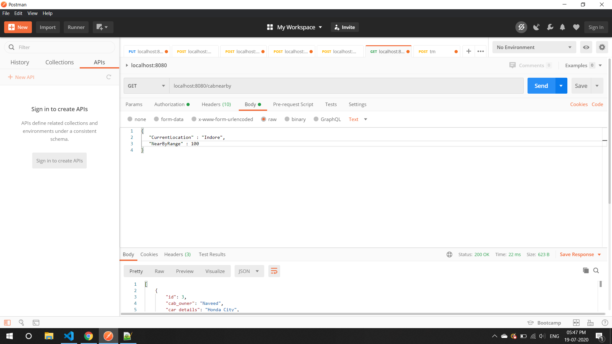
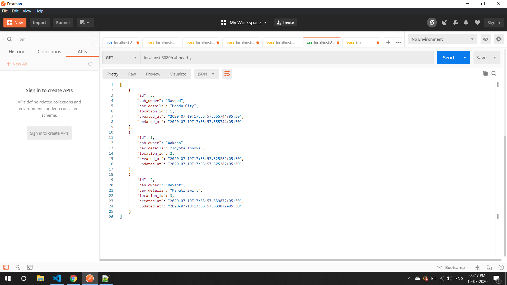

Get All Bookings of a User (Only logged in user can access)

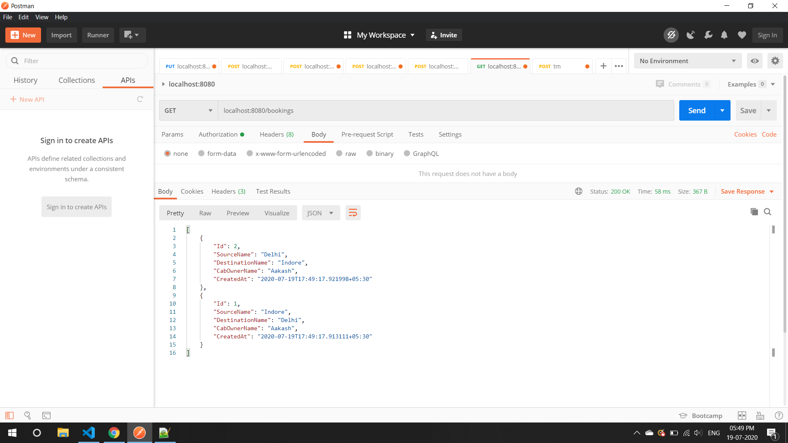
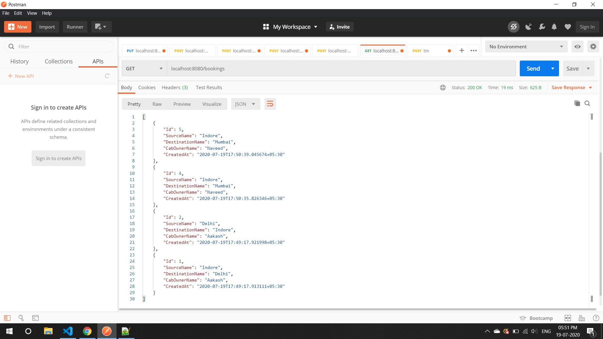

Create A New Booking (Only logged in user can book)

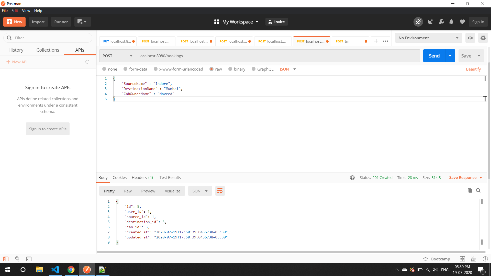
